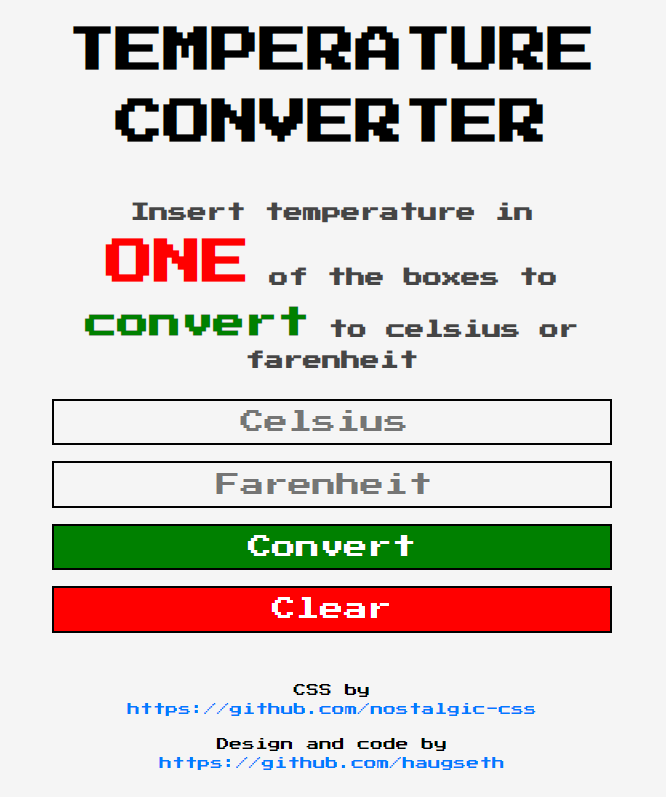

# Temperature Converter (Gatsby FuncJam '21)



## Installation

To install this application, clone the repo and download the node module packages. Run npm start to start the development server

- `git clone URL`
- `npm install`
- `npm start`

## Testing the API function

To test the function run curl or use postman and use the following URL to access the function when running the development server

- http://localhost:8000/api/temperature

Use a POST request with a JSON body like this to convert temperature from celsius to farenheit:

```json
{
    "celsius": "6"
}
```

Use a POST request with a JSON body like this to convert temperature from farenheit to celsius:

```json
{
    "farenheit": "90"
}
```

## Submission Checklist

- [x] Add installation documentation to the README
- [x] Update the `/api` folder with your function
- [x] Submit your theme at https://gatsbyjs.com/func-jam-21/

## Helpful Links

Read the Gatsby [functions docs](https://www.gatsbyjs.com/docs/reference/functions/).
Check out this video all about Gatsby functions 
Take a look at the Functions Use Cases over [here](https://www.gatsbyjs.com/products/cloud/functions/). 

## Credits

- Vintage CSS styles from https://github.com/nostalgic-css